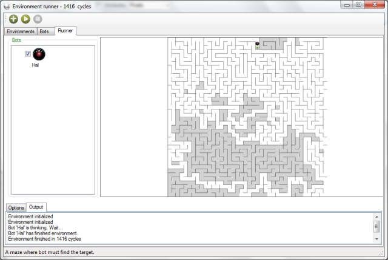
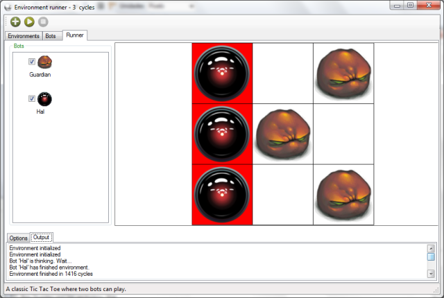
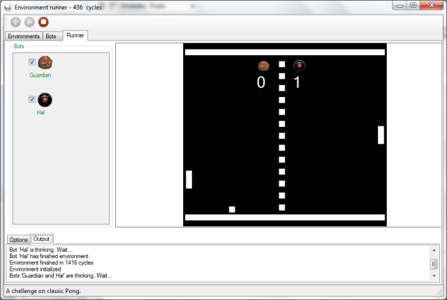
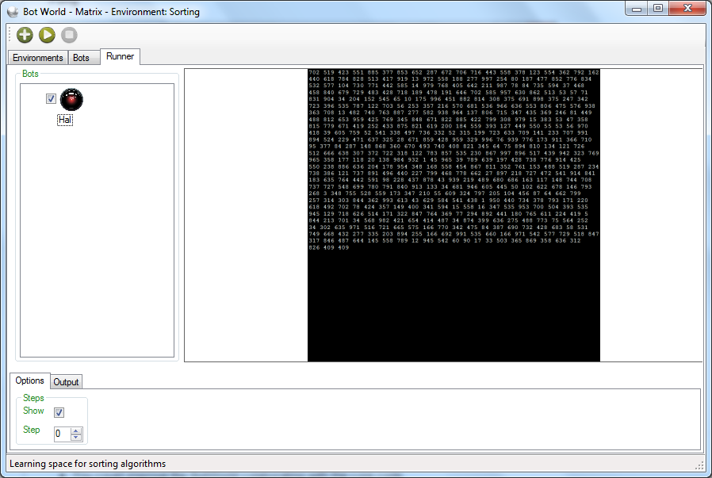

BotWorld
==================

A platform to create bots, environments and renderers for simulations.

Do you know RoboCode? Now, imagine a world where you can create any type of environment to make programmers get engaged in an immersive challenge. This is one of possibilities on BotWorld.

It may be used as
--------

- An learning environment for programming techniques.
- An immersive environment for programming challenges.
- An tool to help create colaborative games.
- And anything else you imagine.

What are the current available environments?
--------
**Maze**

**Tic Tac Toe**

**Pong**

**Sorting**

How can I work with it?
--------
- You could just use the available environment, renderers and bots to teach and learn programming techniques.
- You could improve the BotWorld colaborating with the core code.
- You could create an environment and his SDK:
	- Maze and MazeSdK.
	- TicTacToe and TicTacToeSdk
	- Pong and PongSdk
	- Sorting and SortingSdk
- You could create environments renderers:
	- Maze
	- TicTacToe
	- Pong
	- Sorting
- You could create a bot and his abilities to interact with some environments:
	- HalBot
		- Abilities.Games.Maze
		- Abilities.Games.TicTacToe
		- Abilities.Games.Pong
		- Abilities.Learning.Sorting

